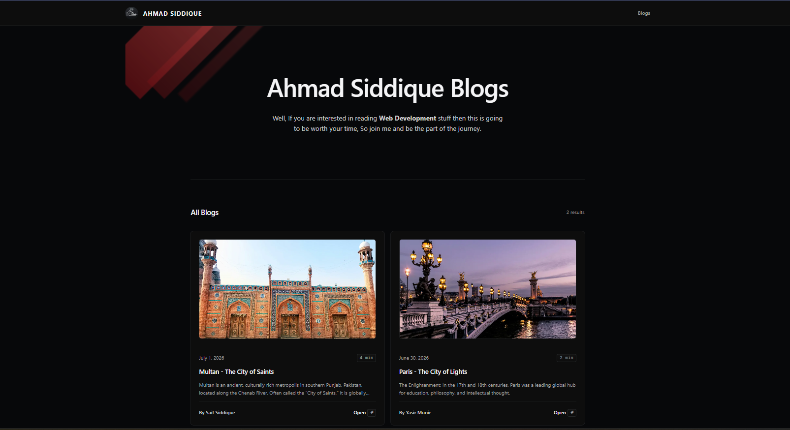

# Blog Website

> This website is a little different from our traditional blog website because this uses CMS(sanity) to automate the procedure of writting blogs



## Tech Stack
| Technology | Purpose |
| --- | --- | 
| Nextjs | We know why we use Nextjs | 
| Sanity | Content Operation Management |
| Tailwind | Because I can't write CSS | 
| Shadcn UI | UI library to make my life easy |

## Installation
**git** must be installed on your system before proceding:

```bash
git clone https://github.com/ahmadsiddique-dev/blog.git
```

## Twist
you have to setup an Environment variable in /app/web/src
```bash 
SANITY_API_READ_TOKEN=
```

change directory
```bash
cd blog
```

Since this is a **Monorepo** so once it is installed then you can install packages

```bash
pnpm i
```

Run development server

```bash
pnpm run dev
```

Now your **CMS** is live and also your **Application** is up and running 

Go to

```javascript
http://localhost:3000
```
to access Studio hit
```javascript
http://localhost:3333
```

